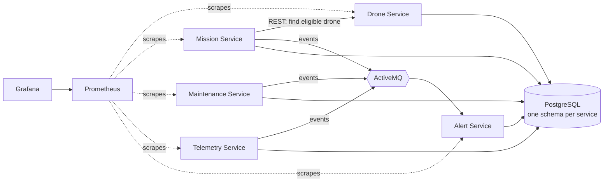
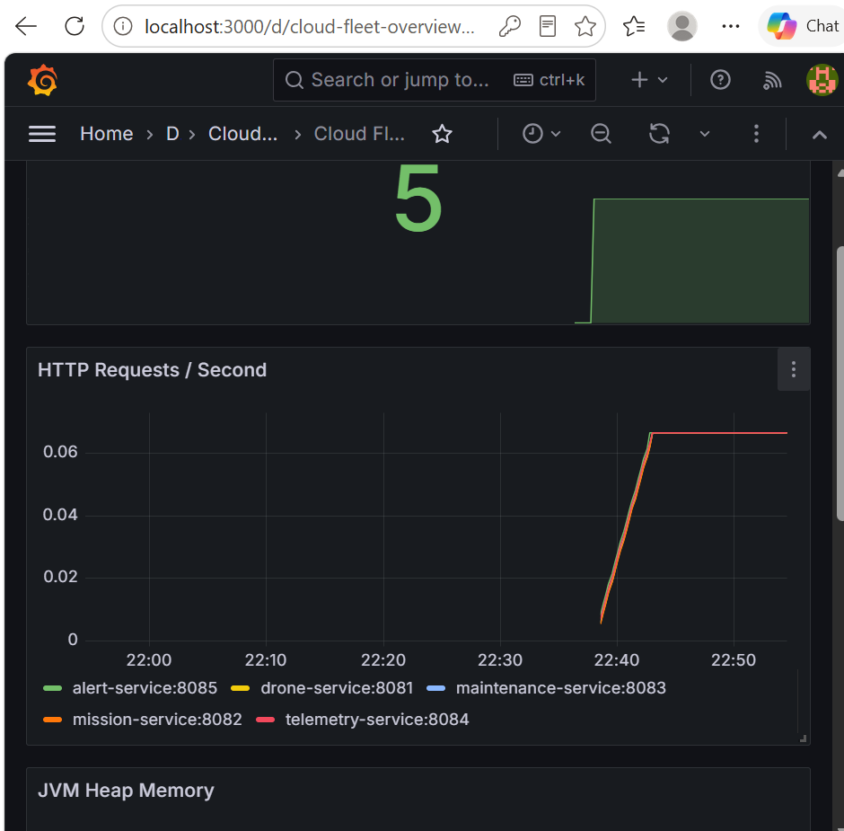
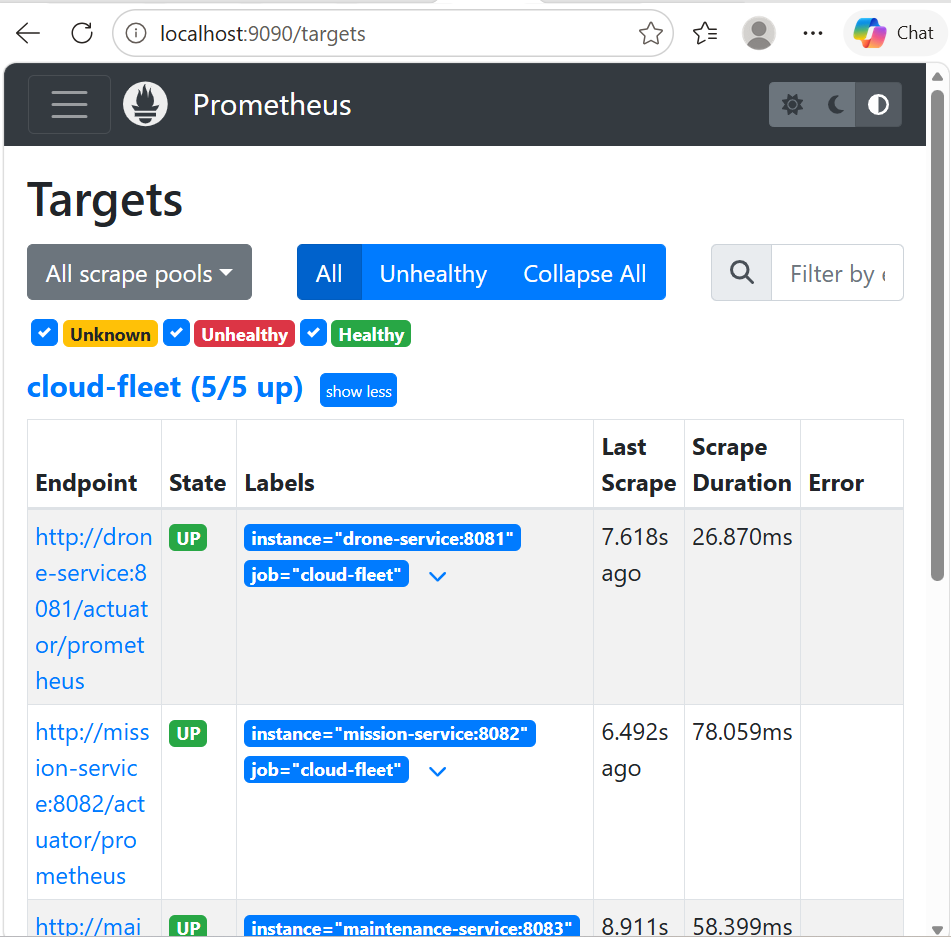
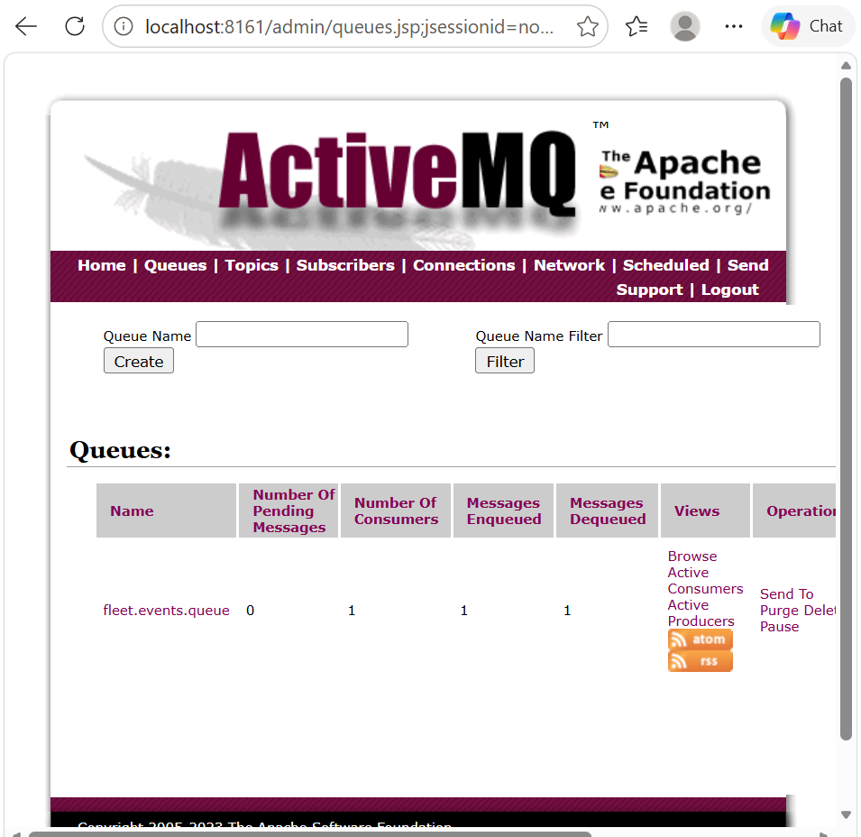

<div align="center">

# 🚁 Cloud Fleet

**A drone fleet platform built from five Spring Boot microservices that communicate over REST and asynchronous events.**


</div>

Register drones, create delivery missions, let the platform select an eligible drone, and watch alerts appear automatically when events such as low battery or overdue maintenance occur.

## Why I built it

I wanted a project that feels like the problems backend and integration teams actually face: several services with their own data, synchronous calls *and* asynchronous events, database decisions that matter, automated testing, and monitoring I can actually inspect.

Cloud Fleet is that project.

## How it fits together



| Service | What it owns | Port |
|---|---|---:|
| Drone | Inventory, status, battery, payload | 8081 |
| Mission | Mission lifecycle and drone assignment | 8082 |
| Maintenance | Scheduling and overdue detection | 8083 |
| Telemetry | Drone readings and history | 8084 |
| Alert | Turns events into alerts that can be acknowledged | 8085 |

Prometheus runs on `:9090`, Grafana on `:3000`, and the ActiveMQ console on `:8161`.

## Observability

### Grafana Dashboard

<p align="center">
  
</p>

The provisioned Grafana dashboard displays live metrics from all five Spring Boot services, including service availability, HTTP request activity, JVM heap usage and database connection metrics.

### Prometheus Targets

<p align="center">
  
</p>

Prometheus successfully scrapes all five Cloud Fleet application services.

### ActiveMQ Event Flow

<p align="center">
  
</p>

The `fleet.events.queue` shows a real event being published and consumed.

During testing, telemetry for `DRN-001` was submitted with a battery level of `15%`. The Telemetry Service published a `BatteryLow` event to ActiveMQ, the Alert Service consumed it, and a `WARNING` alert was persisted.

The broker recorded both the enqueue and dequeue while leaving no message stuck in the queue.

## Try it in 3 steps

```bash
mvn clean package
docker compose up --build
curl http://localhost:8081/actuator/health
```

Give the services a few seconds to start.

You can repeat the health check on ports `8082` through `8085`.

## Take it for a spin

A full request collection lives in [`cloud-fleet.http`](cloud-fleet.http).

The short version:

```text
1. POST /api/drones             on :8081   register a drone
2. POST /api/missions           on :8082   create a mission
3. PUT  /api/missions/1/assign  on :8082   Mission Service asks Drone Service for an eligible drone
4. PUT  /api/missions/1/start   on :8082   drone goes IN_FLIGHT
5. PUT  /api/missions/1/complete            drone becomes AVAILABLE again
```

To exercise the event-driven side of the platform, send telemetry with a battery level of `20%` or below and then check:

```text
GET http://localhost:8085/api/alerts
```

A `BatteryLow` event travels through ActiveMQ and becomes a `WARNING` alert without the Telemetry Service calling the Alert Service directly.

## The parts I'm proudest of

### 🔔 Events that mean something

The platform publishes domain events including:

- `MissionAssigned`
- `MissionStarted`
- `MissionCompleted`
- `MissionFailed`
- `BatteryLow`
- `MaintenanceDue`
- `MaintenanceCompleted`
- `InvalidTelemetry`

The Alert Service consumes fleet events and determines their severity.

Examples:

```text
MissionFailed       → CRITICAL
DroneOffline        → CRITICAL
BatteryLow          → WARNING
MaintenanceDue      → WARNING
InvalidTelemetry    → WARNING
MissionCompleted    → INFO
```

This keeps event producers independent from the service responsible for presenting and storing alerts.

### 🐘 A database I actually tuned

Each service owns its own PostgreSQL schema and manages schema changes with **Flyway**.

The Maintenance Service frequently searches for unfinished and overdue records, so I added **partial indexes** that only cover the rows relevant to those queries.

I then tested the indexes with:

```sql
EXPLAIN ANALYZE
```

On a very small table, PostgreSQL correctly chose a sequential scan.

After generating a larger dataset, PostgreSQL switched to an `Index Scan`.

The useful lesson was that adding an index does not automatically make a query faster. Table size, selectivity and the query planner still matter.

Full write-up: [docs/query-optimisation.md](docs/query-optimisation.md).

### 📈 Monitoring from day one

Every service exposes Spring Boot Actuator endpoints and Prometheus-compatible metrics.

Prometheus collects those metrics and Grafana visualises them through a dashboard that is automatically provisioned when the Docker Compose environment starts.

The current monitoring stack provides visibility into:

- Service availability
- HTTP request activity
- JVM heap usage
- Database connection metrics
- Prometheus scrape health

### 📨 Asynchronous communication

Cloud Fleet uses **ActiveMQ and Spring JMS** for communication that does not require a synchronous response.

For example:

```text
Telemetry Service
      ↓
BatteryLow event
      ↓
ActiveMQ
      ↓
Alert Service
      ↓
WARNING alert
```

The services therefore do not need direct knowledge of each other for this workflow.

### 🧪 Real PostgreSQL integration testing

The Drone Service includes an integration test using **Testcontainers** and a real PostgreSQL container rather than replacing persistence with an in-memory database.

The test verifies that a drone can be persisted and retrieved using the same type of database used by the application.

```text
Tests run: 1
Failures: 0
Errors: 0
Skipped: 0
```

### ⚙️ Continuous Integration

GitHub Actions automatically validates the project through separate stages for:

```text
Build
  ↓
Unit Tests
  ↓
Integration Tests
```

The integration-test job starts a real PostgreSQL Testcontainer and runs the Drone Service persistence test in CI.

This gives the repository automated proof that the application builds and its database integration still works after changes.

## Tech stack

| Area | Technologies |
|---|---|
| **Backend** | Java 21, Spring Boot 3.5, Spring Web, Spring Data JPA |
| **Build** | Maven |
| **Data** | PostgreSQL 16, Flyway, HikariCP |
| **Messaging** | ActiveMQ, Spring JMS |
| **Observability** | Spring Boot Actuator, Micrometer, Prometheus, Grafana |
| **Testing** | JUnit 5, Mockito, Testcontainers |
| **CI** | GitHub Actions |
| **Infrastructure** | Docker, Docker Compose |

## Tests

Run the complete test suite:

```bash
mvn clean test
```

Build the complete multi-module project:

```bash
mvn clean package
```

Run the PostgreSQL integration test:

```bash
mvn -DskipTests install
mvn -pl drone-service -Dtest=DroneRepositoryIT test
```

Build a specific service with its required modules:

```bash
mvn -pl maintenance-service -am package
```

## Project structure

```text
cloud-fleet-microservices/
├── drone-service/
├── mission-service/
├── maintenance-service/
├── telemetry-service/
├── alert-service/
├── shared-events/
├── monitoring/
│   ├── prometheus/
│   └── grafana/
├── docs/
│   └── images/
├── .github/
│   └── workflows/
├── cloud-fleet.http
├── docker-compose.yml
└── pom.xml
```

## More docs

[Architecture](docs/architecture.md) ·
[Database design](docs/database-design.md) ·
[Query optimisation](docs/query-optimisation.md) ·
[Testing strategy](docs/testing-strategy.md) ·
[Troubleshooting](docs/troubleshooting.md) ·
[Cloud deployment](docs/cloud-deployment.md) ·
[Design decisions](docs/design-decisions.md)

## What's next

- [x] CI pipeline for build, unit tests and integration tests
- [x] Integration tests with real PostgreSQL using Testcontainers
- [x] Prometheus monitoring
- [x] Provisioned Grafana dashboard
- [x] Verified ActiveMQ event flow
- [ ] Retries and circuit breakers with Resilience4j
- [ ] Dead-letter queue
- [ ] Idempotent event consumers
- [ ] JWT authentication and role-based access
- [ ] API gateway
- [ ] Publish container images through CI
- [ ] Deploy to AWS using managed infrastructure

---

<p align="center">
Built by <a href="https://github.com/ZinhleHlongwane">Zinhle Hlongwane</a> · Johannesburg 🇿🇦 · <a href="https://www.linkedin.com/in/zinhle-hlongwane-872354209">LinkedIn</a>
</p>