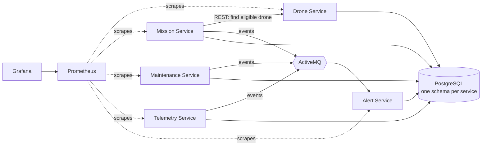

<div align="center">

# 🚁 Cloud Fleet

**A drone fleet platform built from five Spring Boot microservices that talk over REST *and* events.**


</div>

Register drones, create delivery missions, let the platform pick an eligible drone, and watch alerts appear on their own when a battery runs low or maintenance is overdue.

## Why I built it

I wanted a project that feels like the problems backend and integration teams actually face: several services with their own data, synchronous calls *and* asynchronous events, a database I had to think hard about, and monitoring I could actually look at. Cloud Fleet is that project.

## How it fits together



| Service | What it owns | Port |
|---|---|---|
| Drone | Inventory, status, battery, payload | 8081 |
| Mission | Mission lifecycle and drone assignment | 8082 |
| Maintenance | Scheduling, overdue detection | 8083 |
| Telemetry | Drone readings and history | 8084 |
| Alert | Turns events into alerts you can acknowledge | 8085 |

Prometheus runs on `:9090`, Grafana on `:3000`, ActiveMQ console on `:8161`.

## Try it in 3 steps

```bash
mvn clean package          # build all services
docker compose up --build  # start everything (Postgres, ActiveMQ, 5 services, Prometheus, Grafana)
curl http://localhost:8081/actuator/health
```

Give the services a few seconds to come up. Repeat the health check on ports `8082`-`8085`.

## Take it for a spin

A full request collection lives in [`cloud-fleet.http`](cloud-fleet.http). The short version:

```text
1. POST /api/drones            on :8081   register a drone
2. POST /api/missions          on :8082   create a mission
3. PUT  /api/missions/1/assign on :8082   Mission Service asks Drone Service for an eligible drone
4. PUT  /api/missions/1/start  on :8082   drone goes IN_FLIGHT
5. PUT  /api/missions/1/complete          drone is AVAILABLE again
```

Now send telemetry with the battery at 20% or below and check `GET :8085/api/alerts`. A `BatteryLow` event travelled through ActiveMQ and became a `WARNING` alert, without any service calling another directly.

## The parts I'm proudest of

### 🔔 Events that mean something

Services publish `MissionAssigned`, `MissionCompleted`, `MissionFailed`, `BatteryLow`, `MaintenanceDue` and more. The Alert Service decides severity from the event type (`MissionFailed` is `CRITICAL`, `BatteryLow` is `WARNING`, `MissionCompleted` is `INFO`).

### 🐘 A database I actually tuned

Each service owns its schema and migrates it with **Flyway**. The maintenance service constantly looks for unfinished, overdue records, so I added **partial indexes** that only cover those rows.

Then I tested it with `EXPLAIN ANALYZE`. On a tiny table, Postgres correctly ignored my index and used a sequential scan. After generating a larger dataset it switched to an `Index Scan`. The lesson: an index helps depending on table size and selectivity, not just because it exists.

Full write-up: [docs/query-optimisation.md](docs/query-optimisation.md).

### 📈 Monitoring from day one

Every service exposes health and Prometheus metrics via Spring Boot Actuator. A provisioned Grafana dashboard shows services up, requests per second, JVM heap and active database connections, and it's rebuilt automatically when Docker Compose starts.

## Tech stack

| | |
|---|---|
| **Backend** | Java 21, Spring Boot 3.5, Spring Web, Spring Data JPA, Maven |
| **Data** | PostgreSQL 16, Flyway, HikariCP |
| **Messaging** | ActiveMQ, Spring JMS |
| **Observability** | Actuator, Micrometer, Prometheus, Grafana |
| **Testing** | JUnit 5, Mockito |
| **Infra** | Docker, Docker Compose |

## Tests

```bash
mvn clean test                          # everything
mvn -pl maintenance-service -am package # one module
```

## More docs

[Architecture](docs/architecture.md) · [Database design](docs/database-design.md) · [Query optimisation](docs/query-optimisation.md) · [Testing strategy](docs/testing-strategy.md) · [Troubleshooting](docs/troubleshooting.md) · [Cloud deployment](docs/cloud-deployment.md) · [Design decisions](docs/design-decisions.md)

## What's next

- [ ] JWT authentication and roles
- [ ] API gateway
- [ ] Retries and circuit breakers (Resilience4j)
- [ ] Dead-letter queue and idempotent consumers
- [ ] Integration tests with real PostgreSQL (Testcontainers)
- [ ] Deploy to AWS (RDS, containers, Secrets Manager)
- [ ] CI pipeline that builds and publishes container images

---

<p align="center">Built by <a href="https://github.com/ZinhleHlongwane">Zinhle Hlongwane</a> · Johannesburg 🇿🇦 · <a href="https://www.linkedin.com/in/zinhle-hlongwane-872354209">LinkedIn</a></p>
